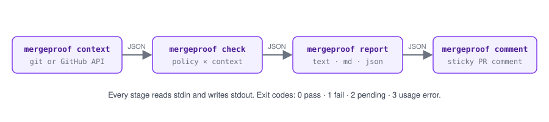

# mergeproof

**Proof before merge.** Pull requests earn their merge with evidence, not claims.

[](https://github.com/Aryamanz29/mergeproof/actions/workflows/ci.yml)
[](https://pypi.org/project/mergeproof/)
[](https://pypi.org/project/mergeproof/)
[](LICENSE)

`mergeproof` is an evidence gate for pull requests. One YAML file says what a change must
*prove* before it merges: tests for the modules it touched, a green integration job,
before/after links from a live environment, a human who actually opened those links. CI
enforces it. Coding agents read the same file, so the process stops living in review comments.


## Why

Agents are good at claiming outcomes. "Added tests, verified on staging" costs nothing to
write. Checklists don't help; a checkbox is self-attestation. What holds up is an artifact
somebody else can open: a changed test file, a trace id that resolves, a screenshot pair, a
sign-off tied to the exact commit. `mergeproof` checks those, verifies them against their
source when it can, and leaves the last word to a person who is not the author.

## Install

```sh
pip install mergeproof            # or: uv tool install mergeproof
pip install 'mergeproof[mcp]'     # adds the MCP server for coding agents
```

## Five-minute tour

```sh
mergeproof init          # writes a starter mergeproof.yaml
mergeproof checks        # what checks exist and what they take
mergeproof explain       # what must the current diff prove, what is missing right now
mergeproof template      # the evidence block still missing, ready to paste into the PR
mergeproof check         # the gate: exit 0 pass, 1 fail, 2 pending
```

`explain` on a branch that changed a tool module and nothing else:

```text
# What this change must prove (fail)

## tool-change-needs-unit-tests [block]
Every changed tool module ships with changed unit tests for that module.
Triggered by `server/tools/search.py`.

- ❌ **unit tests for touched tools**: Each changed source file needs a changed test file:
  `server/tools/{name}.py` needs `tests/unit/**/test_{name}*.py`.
  - now: 1 changed source file(s) without test changes
  - server/tools/search.py: expected a changed test matching tests/unit/**/test_search*.py
  - fix: Add a regression test for each listed file: it should fail before the change and pass after.
- ⏳ **unit tests green**: CI check run matching `^unit` is green on the head commit.
  - now: CI status for `^unit` is only visible in GitHub mode

## fix-needs-live-evidence [block]
...
## Evidence block to add to the PR description

```evidence
environment: staging
image: <registry>/mcp-server:pr-<n>-<sha7>
traces:
- what: <what was exercised>
  before: https://langfuse.example.com/project/<project-id>/traces/<trace-id>
  after: https://langfuse.example.com/project/<project-id>/traces/<trace-id>
```
```

## The policy file

```yaml
version: 1
project: my-service

rules:
  - id: source-needs-tests
    description: Source changes ship with tests for the touched module.
    when:
      paths: ["src/**/*.py"]
      exclude_paths: ["src/**/__init__.py"]
    require:
      - check: tests.changed
        with:
          map: { "src/{pkg}/{name}.py": "tests/**/test_{name}*.py" }
      - check: ci.job_passed
        with: { name: "^unit", regex: true }

  - id: fix-needs-live-evidence
    description: Bug fixes show the behaviour before and after on staging.
    when:
      title: "^fix"
    instructions: Reproduce on staging, keep the link, deploy, repeat, keep that link too.
    require:
      - check: evidence.field
        with: { key: environment, equals: staging }
      - check: evidence.links
        with: { min_pairs: 1 }
      - check: review.human_verified
        with: { phrase: "/verified", bind_to_head: true }
```

A rule has a `when` (which changes it applies to) and a list of `require`ments, each a check
with parameters. `severity: warn` on a rule or a requirement reports without blocking.

`when` matchers: `paths`, `exclude_paths`, `labels`, `title` (regex), `base_branches`,
`authors`. That last one lets you hold `copilot[bot]` or `claude[bot]` to a stricter rule set
than people.

## Evidence lives in the PR description

A fenced YAML block. Agents can write it, machines can read it, humans can still skim it.

````markdown
```evidence
environment: staging
image: registry.example.com/mcp-server:pr-77-4444444
traces:
  - what: search with empty query
    before: https://langfuse.example.com/project/p1/traces/trace-before-1
    after:  https://langfuse.example.com/project/p1/traces/trace-after-1
```
````

`mergeproof template` prints exactly the block a change still needs. Multiple blocks merge.

## What the PR sees

One comment, updated in place on every push, label change, CI completion and review comment:


Wire it up with the action (copy [`examples/github-workflow.yml`](examples/github-workflow.yml)):

```yaml
on:
  pull_request:
    types: [opened, synchronize, reopened, edited, labeled, unlabeled]
  issue_comment: { types: [created, edited] }   # /verified and agent verdicts land here
  check_suite:   { types: [completed] }         # re-check when CI finishes
jobs:
  gate:
    if: github.event_name != 'issue_comment' || github.event.issue.pull_request
    runs-on: ubuntu-latest
    permissions: { contents: read, pull-requests: write, checks: read }
    steps:
      - uses: actions/checkout@v4
        with: { ref: ${{ github.event.repository.default_branch }} }   # policy from the base branch
      - uses: Aryamanz29/mergeproof@v0.2.0
        env:
          MERGEPROOF_PR_NUMBER: ${{ github.event.issue.number || github.event.pull_request.number }}
```

Make the `mergeproof` check required in branch protection and the gate is enforced.

## Built-in checks

| check | proves |
|---|---|
| `tests.changed` | each changed source file (via `{capture}` globs) or any file has a changed test |
| `files.changed` | the change touches / avoids certain paths (a down-migration, a changelog entry) |
| `evidence.field` | a key in the evidence block exists, equals, matches, or has N items |
| `evidence.links` | before/after link pairs matching a pattern; optional verification through a verifier |
| `ci.job_passed` | a named check run on the head commit succeeded (pending while it runs) |
| `review.human_verified` | a non-author, non-bot comment `/verified <sha7>`; a new push invalidates it |
| `agent.verdict` | an allowed bot posted a head-bound ```verdict block with `verdict: pass` |
| `pr.labels`, `pr.body` | labels present or absent; required sections, regex, minimum length |
| `shell` | a command from the policy exits 0 (changed files in `$MERGEPROOF_FILES`) |

`mergeproof checks` prints every parameter with its default.

## Verifying links against their source

A pasted link should have to be real. `evidence.links` accepts a `pattern` with named groups and
a `verify` name:

```yaml
- check: evidence.links
  with:
    key: traces
    pattern: "^(?P<host>https?://[^/]+)/project/(?P<project>[^/]+)/traces/(?P<trace_id>[\\w-]+)"
    verify: langfuse
```

The core ships `http` (the URL answers 2xx; `verify_options: {auth_header_env: DASH_TOKEN}` for
private dashboards). Anything vendor-specific is a plugin: a class with `verify(url, match)`,
registered under the `mergeproof.verifiers` entry-point group.
[`examples/plugins/mergeproof-langfuse`](examples/plugins/mergeproof-langfuse) is a complete one in
forty lines, for [Langfuse](https://langfuse.com), an MIT-licensed tracer you can self-host and
feed from OpenTelemetry. Jaeger and Arize Phoenix work the same way.

## Non-deterministic reviewers

LLM review agents are witnesses, not the gate. Have yours post a comment:

````markdown
```verdict
check: trace-review
verdict: pass
head: 4444444
confidence: 0.85
summary: the after-trace returns the empty page; the before-trace raises.
```
````

and require it:

```yaml
- check: agent.verdict
  with: { name: trace-review, authors: ["github-actions[bot]"], min_confidence: 0.8 }
```

`authors` pins the verdict to the bot that runs the agent, `bind_to_head` (default) discards it on
the next push, and pairing it with `review.human_verified` keeps a person in the loop. If your
agent already speaks in labels (`reviewed` / `review-failed`), `pr.labels` consumes those.

## For coding agents

Two ways to hand agents the rules, both generated from the policy so they cannot drift:

```sh
mergeproof agent-prompt >> AGENTS.md     # a Markdown section describing every rule and its evidence block
mergeproof mcp                           # an MCP server over stdio
```

`.mcp.json` for Claude Code, Cursor or any MCP client:

```json
{ "mcpServers": { "mergeproof": { "command": "uv", "args": ["run", "mergeproof", "mcp"] } } }
```

Tools: `explain`, `check`, `evidence_block`, `validate_policy`, `list_checks`,
`agent_instructions`; resource `mergeproof://policy`. All read-only. An agent can learn what to
prove and check its own work; it cannot approve anything.

### Tracing the server itself

The MCP SDK wraps every tool call in an OpenTelemetry span. Install the `otel` extra and point the
standard variables at any OTLP/HTTP receiver and those spans are exported; nothing is sent
otherwise.

```sh
pip install 'mergeproof[mcp,otel]'

# Langfuse (self-hosted or cloud): basic auth with the project keys
export OTEL_EXPORTER_OTLP_ENDPOINT=https://langfuse.example.com/api/public/otel
export OTEL_EXPORTER_OTLP_HEADERS="Authorization=Basic $(printf '%s:%s' "$LANGFUSE_PUBLIC_KEY" "$LANGFUSE_SECRET_KEY" | base64)"

# Jaeger or an OpenTelemetry Collector on the default OTLP/HTTP port
export OTEL_EXPORTER_OTLP_ENDPOINT=http://localhost:4318
```

Each span is named after the MCP method and tool (`tools/call explain`) and carries the
`gen_ai.tool.name` attribute, so a dashboard can answer "which agent asked what, and how often did
`check` come back failing" without any code in this project knowing which backend it talks to.

## Plumbing

The porcelain commands are compositions of filters that read and write JSON:



```sh
mergeproof context --github > pr.json            # snapshot a PR (files, body, labels, comments, check runs)
mergeproof check --context pr.json -f json > report.json
mergeproof report report.json -f md              # render later, elsewhere
mergeproof comment report.json                   # post it
```

Snapshots make policies testable: the [examples](examples/) ship scenario files that the
integration suite runs through the CLI, asserting the verdict each one claims.

## Writing a check

```python
from pydantic import BaseModel
from mergeproof import Check, Context, Outcome, Status


class ImageSmokeTested(Check):
    id = "image.smoke_tested"
    description = "The image named in the evidence block was exercised against the environment."

    class Params(BaseModel):
        registry: str

    def run(self, ctx: Context, params: Params, files: list[str]) -> Outcome:
        tag = ctx.evidence().get("image")
        if not tag or not tag.startswith(params.registry):
            return Outcome(
                status=Status.FAIL,
                summary="no image under the expected registry",
                fix="Build the branch image and record its tag under `image`.",
            )
        # query your deployment API here
        return Outcome(status=Status.PASS, summary=f"{tag} smoke-tested")

    def explain(self, params: Params) -> str:
        return f"An image under `{params.registry}` recorded as `image` and smoke-tested."

    def evidence_template(self, params: Params) -> dict:
        return {"image": f"{params.registry}/<name>:pr-<n>-<sha7>"}
```

```toml
[project.entry-points."mergeproof.checks"]
"image.smoke_tested" = "mypkg.checks:ImageSmokeTested"
```

## Prior art

[Danger](https://danger.systems/js/) runs rules written in JavaScript and comments on the PR;
`mergeproof` is declarative, has a notion of evidence, and explains itself to agents.
[policy-bot](https://github.com/palantir/policy-bot) enforces rich approval policies but only sees
GitHub-native data. Checklist actions fail on unticked boxes, which is the thing agents will tick.
Hosted "evidence gate" products evaluate your artifacts on their servers. `mergeproof` borrows
policy-bot's matchers and Danger's sticky comment and runs entirely in your CI.

## Exit codes

| code | meaning |
|---|---|
| 0 | pass, or only warnings |
| 1 | a blocking requirement failed or errored |
| 2 | a blocking requirement is pending (CI running, reviewer not yet verified) |
| 3 | usage or policy error |

## Development

```sh
make setup            # uv sync, example plugin, pre-commit hooks
make lint typecheck test integration
make check            # this repository's own gate against your working tree
```

MIT. See [CONTRIBUTING.md](CONTRIBUTING.md).
