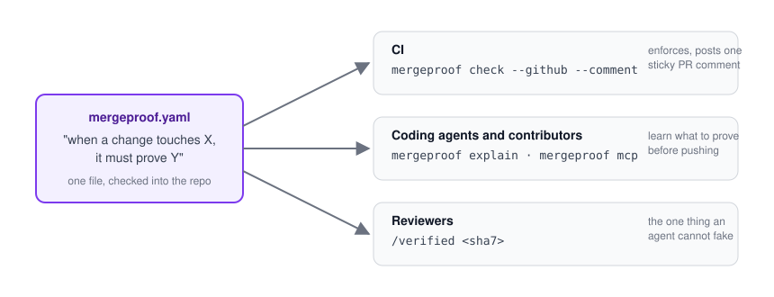
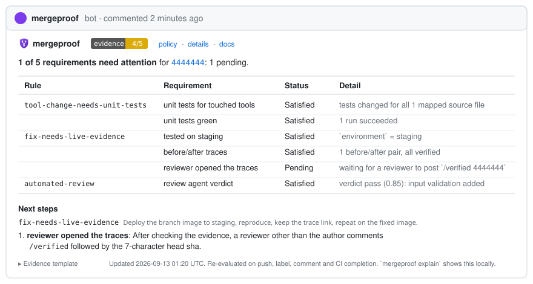

<p align="center">
  
</p>

<h1 align="center">mergeproof</h1>

<p align="center"><strong>Proof before merge.</strong> Pull requests earn their merge with evidence, not claims.</p>

<p align="center">

[](https://github.com/Aryamanz29/mergeproof/actions/workflows/ci.yml)
[](https://pypi.org/project/mergeproof/)
[](https://pypi.org/project/mergeproof/)
[](https://github.com/marketplace/actions/mergeproof)
[](LICENSE)

</p>

`mergeproof` gates pull requests on **evidence**. A policy file in the repository says what a change
must prove before it merges: tests for the modules it touched, a green integration job, before/after
links from a live environment, a human who opened them. CI enforces it and reports on the PR. Coding
agents read the same file, through `AGENTS.md` or an MCP server, so what they are told is what CI
checks.

<p align="center"></p>

## Why

Agentic development makes outcomes cheap to claim and expensive to verify. "Added tests, checked on
staging" costs nothing to type. A checkbox is self-attestation. What holds up is an artifact someone
else can open: a changed test file, a trace id that resolves, a screenshot pair, a sign-off bound to
the exact commit. `mergeproof` checks those, verifies them at their source when it can, and keeps
the last word with a person who is not the author.

## Quickstart

**1. Install and write a policy**

```sh
pip install mergeproof        # or: uv tool install mergeproof
mergeproof init               # writes mergeproof.yaml
```

```yaml
# mergeproof.yaml
version: 1
rules:
  - id: source-needs-tests
    description: Source changes ship with tests for the touched module.
    when:
      paths: ["src/**/*.py"]
    require:
      - check: tests.changed
        with: { map: { "src/{pkg}/{name}.py": "tests/**/test_{name}*.py" } }
      - check: ci.job_passed
        with: { name: "^unit", regex: true }

  - id: fix-needs-live-evidence
    description: Bug fixes show the behaviour before and after on staging.
    when:
      title: "^fix"
    require:
      - check: evidence.field
        with: { key: environment, equals: staging }
      - check: evidence.links
        with: { min_pairs: 1 }
      - check: review.human_verified
```

**2. Add the workflow** (full version in [`examples/github-workflow.yml`](examples/github-workflow.yml))

```yaml
# .github/workflows/mergeproof.yml
on:
  pull_request:
    types: [opened, synchronize, reopened, edited, labeled, unlabeled]
  issue_comment: { types: [created, edited] }
  check_suite:   { types: [completed] }
jobs:
  gate:
    name: 🛡️ mergeproof
    if: github.event_name != 'issue_comment' || github.event.issue.pull_request
    runs-on: ubuntu-latest
    permissions: { contents: read, pull-requests: write, statuses: write, checks: write }
    steps:
      - uses: actions/checkout@v4
        with: { ref: ${{ github.event.repository.default_branch }} }
      - uses: Aryamanz29/mergeproof@v0
        env:
          MERGEPROOF_PR_NUMBER: ${{ github.event.issue.number || github.event.pull_request.number }}
```

**3. Require the `mergeproof` status** in a ruleset on your default branch. That single required
check stands for everything the policy asks for, CI jobs included. See [docs/github.md](docs/github.md).

## What a pull request sees

<p align="center"></p>

One comment updated in place, a `mergeproof` commit status in the merge box, and a Check Run whose
annotations land on the files concerned. Contributors put evidence in the PR description as a fenced
block that agents can write and machines can read:

````markdown
```evidence
environment: staging
links:
  - what: search with an empty query
    before: https://langfuse.example.com/project/p1/traces/trace-before
    after:  https://langfuse.example.com/project/p1/traces/trace-after
```
````

`mergeproof explain` tells anyone, human or agent, what the current diff still has to prove:

````text
# What this change must prove (fail)

## source-needs-tests [block]
Triggered by `src/api/search.py`.

- ❌ unit tests touched: Each changed source file needs a changed test file.
  - src/api/search.py: expected a changed test matching tests/**/test_search*.py
- ⏳ CI check run matching `^unit` is green on the head commit.
  - now: only visible in GitHub mode

## Evidence block to add to the PR description

```evidence
environment: staging
links:
- what: <what was exercised>
  before: https://<host>/<path-to-run>
  after: https://<host>/<path-to-run>
```
````

## Built-in checks

| check | proves |
|---|---|
| `tests.changed` | changed source files come with changed tests, mapped by `{capture}` globs |
| `files.changed` | the change touches, or avoids, certain paths |
| `evidence.field` | a key in the evidence block exists and has an acceptable value |
| `evidence.links` | before/after link pairs, optionally verified at their source |
| `ci.job_passed` | a named check run on the head commit succeeded |
| `review.human_verified` | a non-author human posted `/verified <sha>`; a new push invalidates it |
| `agent.verdict` | an allowed automated reviewer posted a head-bound verdict block |
| `pr.labels`, `pr.body` | labels present or absent; description sections, regex, length |
| `shell` | a command from the policy exits 0 |

Parameters for each: `mergeproof checks`, or [docs/policy.md](docs/policy.md). Anything vendor-specific
is a plugin: [docs/plugins.md](docs/plugins.md).

## For coding agents

```sh
mergeproof agent-prompt >> AGENTS.md     # the rules, rendered from the policy
mergeproof mcp                           # the same over MCP: explain, check, evidence_block, ...
```

Agents learn what to prove and check their own work before opening the PR. They cannot approve
anything: human verification is the one requirement no token of theirs can satisfy. Details, the
MCP tool table and tracing: [docs/agents.md](docs/agents.md).

## Documentation

| | |
|---|---|
| [docs/policy.md](docs/policy.md) | Rules, `when` matchers, severity, the evidence block, every check and its parameters |
| [docs/github.md](docs/github.md) | Workflow, action inputs, rulesets, the three report channels, posting as your own App, JUnit and reviewdog output |
| [docs/agents.md](docs/agents.md) | `AGENTS.md` generation, the MCP server, OpenTelemetry export |
| [docs/cli.md](docs/cli.md) | Every command, the JSON plumbing, output formats, exit codes |
| [docs/plugins.md](docs/plugins.md) | Writing checks and verifiers, packaging them |
| [examples/](examples/) | Three example projects with scenario fixtures the test suite runs, and a Langfuse verifier plugin |
| [CONTRIBUTING.md](CONTRIBUTING.md) | Development setup, conventions, how releases happen |

## Run without installing

```sh
uvx --from 'mergeproof[mcp]' mergeproof explain
docker run --rm -v "$PWD":/repo ghcr.io/aryamanz29/mergeproof check --local
```

Images: `ghcr.io/aryamanz29/mergeproof` tagged `X.Y.Z`, `X.Y`, `X`, `latest` per release, `edge` for `main`.

## How it compares

[Danger](https://danger.systems/js/) runs rules written in JavaScript and comments on the PR.
[policy-bot](https://github.com/palantir/policy-bot) enforces approval policies from GitHub-native
data. Checklist actions fail on unticked boxes. Hosted evidence gates evaluate your artifacts on
their servers. `mergeproof` is declarative, has a notion of evidence that can be verified at its
source, explains itself to agents, and runs entirely in your CI.

## License

MIT. Contributions welcome; see [CONTRIBUTING.md](CONTRIBUTING.md).
