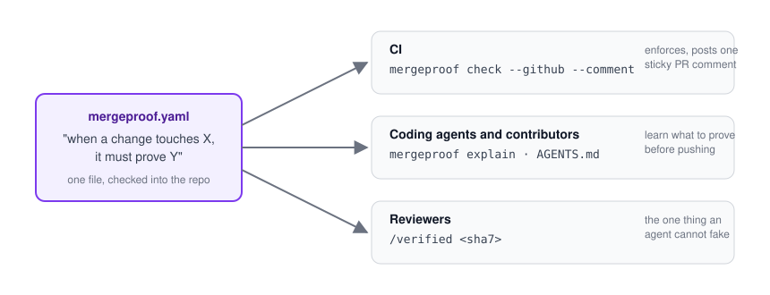

<p align="center">
  
</p>

<h1 align="center">mergeproof</h1>

<p align="center"><strong>Proof before merge.</strong> Pull requests earn their merge with evidence, not claims.</p>

<p align="center">
  <a href="https://github.com/Aryamanz29/mergeproof/actions/workflows/ci.yml"></a>
  <a href="https://pypi.org/project/mergeproof/"></a>
  <a href="https://pypi.org/project/mergeproof/"></a>
  <a href="https://github.com/marketplace/actions/mergeproof"></a>
  <a href="https://aryamanz29.github.io/mergeproof/"></a>
  <a href="LICENSE"></a>
</p>

<p align="center">
  <a href="https://aryamanz29.github.io/mergeproof/">Documentation</a> ·
  <a href="https://aryamanz29.github.io/mergeproof/getting-started/quickstart/">Quickstart</a> ·
  <a href="https://aryamanz29.github.io/mergeproof/reference/checks/">Checks</a> ·
  <a href="examples/">Examples</a> ·
  <a href="CHANGELOG.md">Changelog</a>
</p>

`mergeproof` gates pull requests on **evidence**. One YAML file in the repository says what a change
must prove before it merges: tests for the modules it touched, a green integration job, before/after
links from a live environment, a human who opened them. CI enforces it and reports on the PR. Coding
agents read the same file, so what they are told is what CI checks.

<p align="center"></p>

## What a pull request sees

<p align="center"></p>

- **One comment**, updated in place. A pill per rule coloured by its worst requirement, one sentence,
  then only what blocks the merge and what to do about it. Satisfied and warning requirements follow
  as the receipt. Nothing is collapsed.
- **One commit status**, `mergeproof`, in the merge box. Require that single context and the policy
  decides what stands behind it, CI jobs included.
- **Review comments on the files concerned.** A missing test is posted on the source file it is
  missing for, updated as the PR changes and removed once satisfied.

Locally, `mergeproof explain` prints the same list for the working tree, so people and agents see it
before they push.

## Quickstart

```sh
pip install mergeproof        # or: uv tool install mergeproof
mergeproof init               # writes a starter mergeproof.yaml
```

```yaml
# mergeproof.yaml
version: 1
rules:
  - id: source-needs-tests
    description: Source changes ship with tests for the touched module.
    when:
      paths: ["src/**/*.py"]
    require:
      - check: tests.changed
        with: { map: { "src/{pkg}/{name}.py": "tests/**/test_{name}*.py" } }
      - check: ci.job_passed
        with: { name: "^unit", regex: true }

  - id: fix-needs-live-evidence
    description: Bug fixes show the behaviour before and after on staging.
    when:
      title: "^fix"
    require:
      - check: evidence.links
        with: { key: traces, min_pairs: 1, verify: http }
      - check: review.human_verified
```

```yaml
# .github/workflows/mergeproof.yml
on:
  pull_request:
    types: [opened, synchronize, reopened, edited, labeled, unlabeled]
  issue_comment: { types: [created, edited] }
  check_suite:   { types: [completed] }
jobs:
  gate:
    if: github.event_name != 'issue_comment' || github.event.issue.pull_request
    runs-on: ubuntu-latest
    permissions: { contents: read, pull-requests: write, statuses: write, checks: read }
    steps:
      - uses: actions/checkout@v4
        with: { ref: ${{ github.event.repository.default_branch }} }
      - uses: Aryamanz29/mergeproof@v0
        env:
          MERGEPROOF_PR_NUMBER: ${{ github.event.issue.number || github.event.pull_request.number }}
```

Then require the `mergeproof` status on your default branch. The
[quickstart](https://aryamanz29.github.io/mergeproof/getting-started/quickstart/) walks through all
three steps; the full workflow with comments is
[`examples/github-workflow.yml`](examples/github-workflow.yml).

## Evidence

Anything a check can inspect: a changed file, a green job, a link that resolves, a comment from a
person. What the contributor supplies goes in the PR description as a fenced block that agents can
write and machines can read:

````markdown
```evidence
environment: staging
traces:
  - what: search with an empty query
    before: https://www.braintrust.dev/app/acme/p/service/logs?r=b6f98332e178f658
    after:  https://www.braintrust.dev/app/acme/p/service/logs?r=db0100b2192984af
```
````

Links are verified at their source: `http` ships in core, Langfuse and Braintrust verifiers are
[plugins](https://aryamanz29.github.io/mergeproof/extending/plugins/) of a dozen lines each. Human
sign-off is `/verified <sha7>` from someone other than the author; a new push invalidates it.

## Built-in checks

| check | proves |
|---|---|
| `tests.changed` | changed source files come with changed tests, mapped by `{capture}` globs |
| `files.changed` | the change touches, or avoids, certain paths |
| `evidence.field` | a key in the evidence block exists and has an acceptable value |
| `evidence.links` | before/after link pairs, optionally verified at their source |
| `ci.job_passed` | a named check run on the head commit succeeded |
| `review.human_verified` | a non-author human posted `/verified <sha>`, bound to the head commit |
| `agent.verdict` | an allowed automated reviewer posted a head-bound verdict block |
| `pr.labels`, `pr.body` | labels present or absent; description sections, regex, length |
| `shell` | a command from the policy exits 0 |

Parameters for each: `mergeproof checks`, or the
[checks reference](https://aryamanz29.github.io/mergeproof/reference/checks/).

## For coding agents

```sh
mergeproof agent-prompt >> AGENTS.md     # the rules, rendered from the policy
mergeproof explain                       # what the current diff still has to prove
```

Agents learn what to prove and check their own work before opening the PR. They cannot approve
anything: human verification is the one requirement no token of theirs can satisfy. See
[Coding agents](https://aryamanz29.github.io/mergeproof/guides/agents/).

## Run without installing

```sh
uvx mergeproof explain
docker run --rm -v "$PWD":/repo ghcr.io/aryamanz29/mergeproof check --local
```

Images are tagged `X.Y.Z`, `X.Y`, `X` and `latest` per release, `edge` for `main`.

## Documentation

The site at **[aryamanz29.github.io/mergeproof](https://aryamanz29.github.io/mergeproof/)** covers:

- [Getting started](https://aryamanz29.github.io/mergeproof/getting-started/install/): install, the
  three-step setup, what a pull request sees.
- [Guides](https://aryamanz29.github.io/mergeproof/guides/policy/): writing a policy, evidence,
  GitHub setup, coding agents, rolling it out without blocking anyone, the examples.
- [Reference](https://aryamanz29.github.io/mergeproof/reference/checks/): every check and parameter,
  the command line, the action's inputs and outputs.
- [Extending](https://aryamanz29.github.io/mergeproof/extending/plugins/): checks and verifiers as
  plugins.
- [Project](https://aryamanz29.github.io/mergeproof/project/contributing/): contributing,
  releasing, FAQ.

## How it compares

[Danger](https://danger.systems/js/) runs rules written in JavaScript and comments on the PR.
[policy-bot](https://github.com/palantir/policy-bot) enforces approval policies from GitHub-native
data. Checklist actions fail on unticked boxes. Hosted evidence gates evaluate your artifacts on
their servers. `mergeproof` is declarative, has a notion of evidence that can be verified at its
source, explains itself to agents, and runs entirely in your CI.

## License

MIT. Contributions welcome; see [CONTRIBUTING.md](CONTRIBUTING.md).
