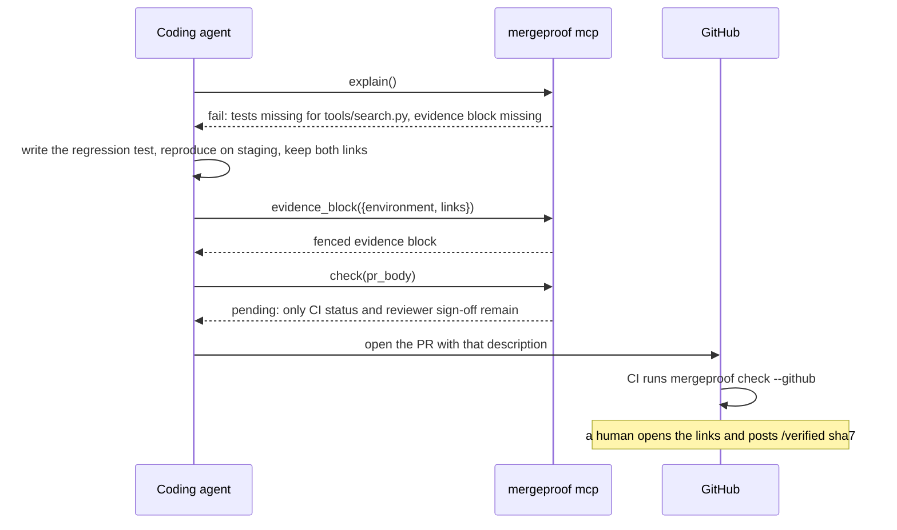

# Coding agents

Agents get the rules two ways. Both are generated from the policy, so what an agent reads is what
CI enforces.

## `AGENTS.md` / `CLAUDE.md`

```sh
mergeproof agent-prompt >> AGENTS.md
```

The section lists every rule, when it applies, what satisfies each requirement, and the evidence
block to fill in, followed by three rules for agents: never fabricate evidence; never post the
human verification phrase; keep the evidence block plain YAML. Regenerate it when the policy
changes.

## MCP server

```sh
pip install 'mergeproof[mcp]'
mergeproof mcp --policy mergeproof.yaml        # stdio; this is what the client launches
```

Register it once per repository. Claude Code reads `.mcp.json` at the repo root; Cursor and other
clients take the same command in their own settings file:

```json
{ "mcpServers": { "mergeproof": { "command": "mergeproof", "args": ["mcp", "--policy", "mergeproof.yaml"] } } }
```

Or without installing: `"command": "uvx", "args": ["--from", "mergeproof[mcp]", "mergeproof", "mcp"]`,
or the container with `docker run -i --rm -v /path/to/repo:/repo ghcr.io/aryamanz29/mergeproof mcp`.

### Tools

| tool | arguments | returns | an agent calls it to |
|---|---|---|---|
| `explain` | `pr_title?`, `pr_body?` | `verdict`, `markdown`, `evidence_template` | learn what the current diff must prove before writing more code |
| `check` | `pr_title?`, `pr_body?` | `verdict`, `exit_code`, the JSON report | dry-run the gate with the PR description it is about to submit |
| `evidence_block` | `data` | the fenced block as text | format evidence instead of hand-writing YAML |
| `validate_policy` | `text?` | `ok`, `problems`, `rules` | edit `mergeproof.yaml` safely; without `text` it validates the repo's file |
| `list_checks` | | id, description and parameter schema of every check, plugins included | write rules with the right ids and parameter names |
| `agent_instructions` | | the `agent-prompt` Markdown | refresh the rules mid-session |

Resource `mergeproof://policy` is the policy file. Everything is read-only against the working tree;
the server cannot post comments, add labels or produce the human sign-off.

### A typical session



| CLI | MCP tool |
|---|---|
| `mergeproof explain` | `explain` |
| `mergeproof check --body-file FILE` | `check` |
| `mergeproof template` | `explain`, field `evidence_template` |
| `mergeproof validate` | `validate_policy` |
| `mergeproof checks` | `list_checks` |
| `mergeproof agent-prompt` | `agent_instructions` |

## Tracing the server

The MCP SDK wraps every tool call in an OpenTelemetry span. With the `otel` extra and the standard
variables set, spans are exported over OTLP/HTTP; otherwise nothing is sent.

```sh
pip install 'mergeproof[mcp,otel]'

# Langfuse: basic auth with the project keys
export OTEL_EXPORTER_OTLP_ENDPOINT=https://langfuse.example.com/api/public/otel
export OTEL_EXPORTER_OTLP_HEADERS="Authorization=Basic $(printf '%s:%s' "$LANGFUSE_PUBLIC_KEY" "$LANGFUSE_SECRET_KEY" | base64)"

# Jaeger or an OpenTelemetry Collector
export OTEL_EXPORTER_OTLP_ENDPOINT=http://localhost:4318
```

Spans are named after the MCP method and tool (`tools/call explain`) and carry `gen_ai.tool.name`.

## Non-deterministic reviewers

LLM review agents take part as witnesses. They post a `verdict` block (see
[policy.md](policy.md#agentverdict)) and `agent.verdict` turns it into a requirement, bound to the
head commit and to an allowed bot account. If a reviewer already speaks in labels, `pr.labels`
consumes those.
