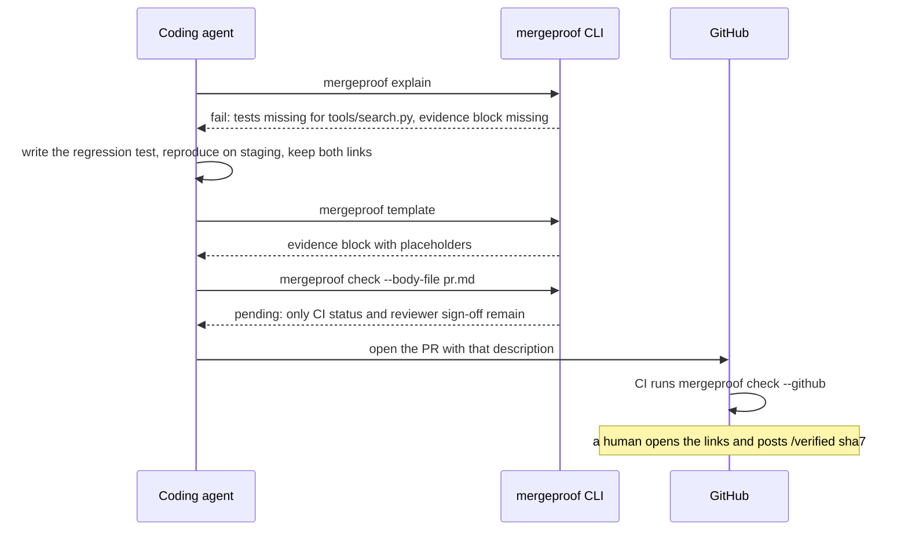

# Coding agents

The policy is written for CI, but agents are its second reader. Two commands make the same rules
available to them; both are generated from the policy, so what an agent is told is what CI checks.

## `AGENTS.md` / `CLAUDE.md`

```sh
mergeproof agent-prompt >> AGENTS.md
```

The section lists every rule, when it applies, what satisfies each requirement, and the evidence
block to fill in, followed by three rules for agents: never fabricate evidence; never post the human
verification phrase; keep the evidence block plain YAML. Regenerate it when the policy changes.

## Before opening a pull request

Any agent with a shell can check its own work the way a person would:

```sh
mergeproof explain                 # what this diff must prove, and what is missing right now
mergeproof template                # the evidence block still missing, ready to paste
mergeproof check --body-file pr.md # dry-run the gate with the description it is about to submit
```

`explain` prints Markdown an agent can reason over: one section per applicable rule, each
requirement with its current state, the fix for anything unmet, and the evidence template at the
end. Exit codes make `check` scriptable: 0 pass, 1 fail, 2 pending.

A typical loop:



What an agent cannot do, by design: satisfy `review.human_verified`. Bot accounts and the PR
author are excluded, and the phrase is bound to the head commit.

## Non-deterministic reviewers

LLM review agents take part as witnesses. They post a `verdict` block (see
[the checks reference](../reference/checks.md#agentverdict)) and `agent.verdict` turns it into a requirement, bound to the
head commit and to an allowed bot account. If a reviewer already speaks in labels, `pr.labels`
consumes those.
