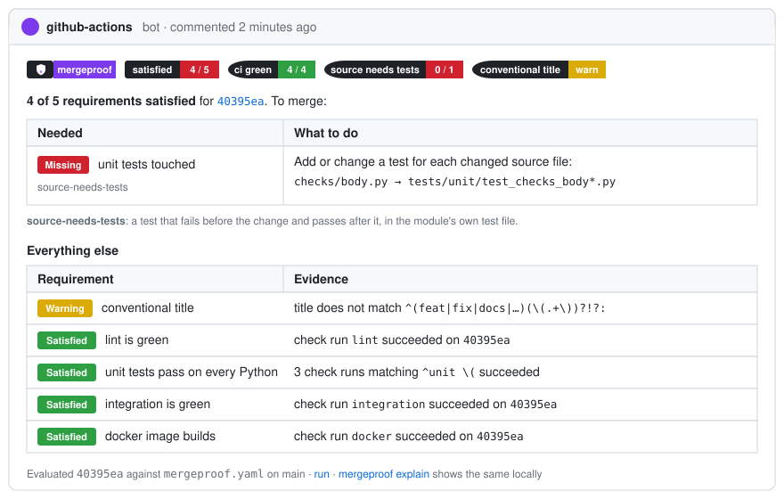

<p align="center"></p>

**Proof before merge.** Pull requests earn their merge with evidence, not claims.

`mergeproof` is an evidence gate for pull requests. One YAML file in the repository says what a
change must *prove* before it merges: tests for the modules it touched, a green integration job,
before/after links from a live environment, a human who opened them. CI enforces it and reports on
the PR. Coding agents read the same file, so what they are told is what CI checks.

<div class="grid cards" markdown>

-   **Declare, don't describe**

    ---

    A rule says "when a change touches `tools/**`, it ships with changed integration tests, if
    the tool has any". No scripts, no review comments to paste.

    [:octicons-arrow-right-24: Writing a policy](guides/policy.md)

-   **Evidence that can be checked**

    ---

    Trace links are looked up at their source, tests must be in the diff, and the reviewer's
    sign-off is bound to the exact commit.

    [:octicons-arrow-right-24: Evidence](guides/evidence.md)

-   **Agents read the same rules**

    ---

    `mergeproof explain` and a generated `AGENTS.md` section tell an agent what to produce before it
    opens the PR. It cannot approve anything.

    [:octicons-arrow-right-24: Coding agents](guides/agents.md)

-   **Reports where people look**

    ---

    A scorecard comment, a requireable commit status, and review comments on the files concerned.

    [:octicons-arrow-right-24: What a pull request sees](getting-started/what-you-see.md)

</div>

## Sixty seconds

```sh
pip install mergeproof
mergeproof init                  # writes a starter mergeproof.yaml
mergeproof explain               # what does the current diff have to prove?
```

Then add [the workflow](getting-started/quickstart.md#2-add-the-workflow), require the `mergeproof`
status, and the gate is on.

<p align="center"></p>

## Why this exists

Agentic development makes outcomes cheap to claim and expensive to verify. "Added tests, checked on
staging" costs nothing to type. A checkbox is self-attestation. What holds up is an artifact someone
else can open: a changed test file, a trace id that resolves, a screenshot pair, a sign-off tied to
the commit. `mergeproof` checks those, verifies them at their source when it can, and keeps the last
word with a person who is not the author.
